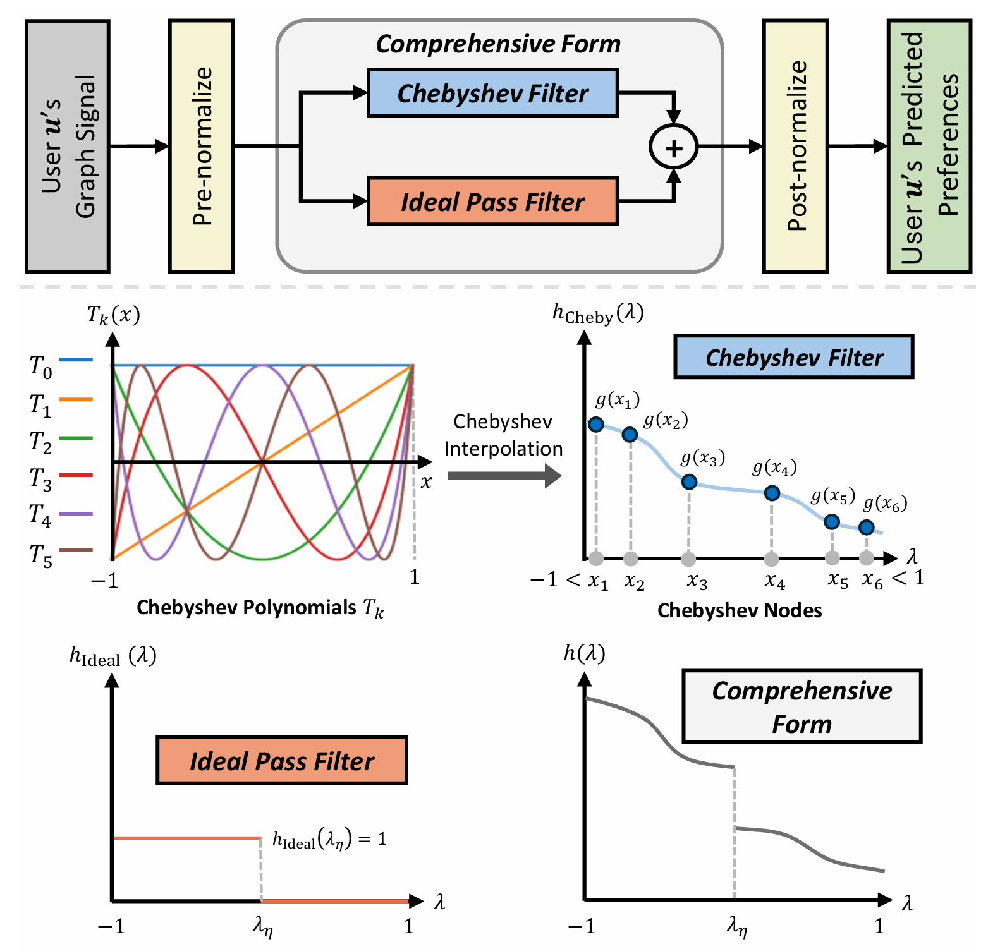
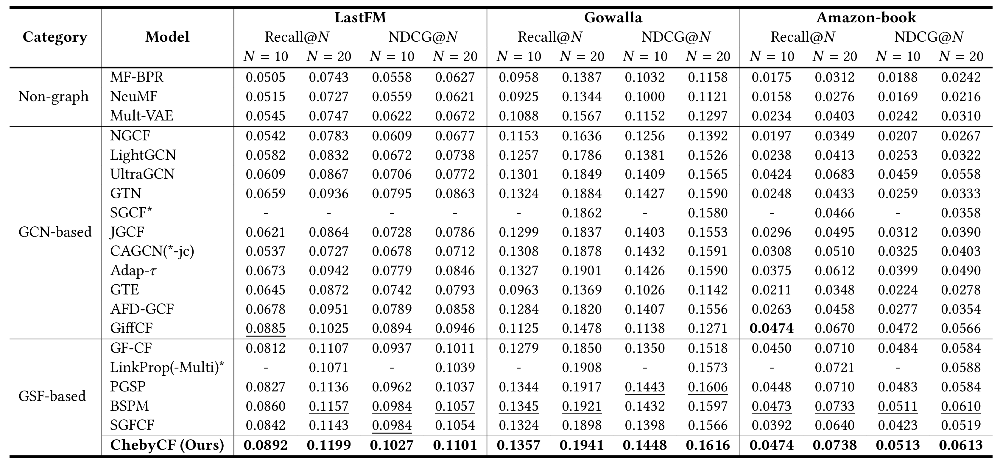

# Graph Spectral Filtering with Chebyshev Interpolation for Recommendation
> Chanwoo Kim, Jinkyu Sung, Yebonn Han, Joonseok Lee

 [](https://arxiv.org/abs/2505.00552)

This repository is the official Pytorch implementation for ChebyCF.
<p align="center">
  
</p>

> Graph convolutional networks have recently gained prominence in collaborative filtering (CF) for recommendations. However, we identify potential bottlenecks in two foundational components. First, the embedding layer leads to a latent space with limited capacity, overlooking locally observed but potentially valuable preference patterns. Also, the widely-used neighborhood aggregation is limited in its ability to leverage diverse preference patterns in a fine-grained manner. Building on spectral graph theory, we reveal that these limitations stem from graph filtering with a cut-off in the frequency spectrum and a restricted linear form. To address these issues, we introduce ChebyCF, a CF framework based on graph spectral filtering. Instead of a learned embedding, it takes a user's raw interaction history to utilize the full spectrum of signals contained in it. Also, it adopts Chebyshev interpolation to effectively approximate a flexible non-linear graph filter, and further enhances it by using an additional ideal pass filter and degree-based normalization. Through extensive experiments, we verify that ChebyCF overcomes the aforementioned bottlenecks and achieves state-of-the-art performance across multiple benchmarks and reasonably fast inference.

## Setup
```bash
conda create -n chebycf python=3.10
conda activate chebycf
conda install pytorch==1.12.1 cudatoolkit=11.3 -c pytorch
conda install numpy==1.22.4 scipy==1.9.3 pyyaml tqdm
```

## Run
```bash
# Execution with command-line arguments
python main.py --model chebycf --dataset last-fm --K 8 --phi 15 --eta 256 --alpha 0.1 --beta 0.2

# Execution with a configuration file
python main.py --config chebycf_last-fm
```

## Performance
<p align="center">
  
</p>

<!-- 
### LastFM
|           | Recall\@10 | Recall\@20 | NDCG\@10  | NDCG\@20  |
| -------   | ---------- | ---------- | --------- | --------- |
| GFCF      | 0.0812     | 0.1107     | 0.0937    | 0.1011    |
|**ChebyCF**| 0.0892     | 0.1199     | 0.1027    | 0.1101    |

### Gowalla
|           | Recall\@10 | Recall\@20 | NDCG\@10  | NDCG\@20  |
| -------   | ---------- | ---------- | --------- | --------- |
| GFCF      | 0.1279     | 0.1850     | 0.1350    | 0.1518    |
|**ChebyCF**| 0.1357     | 0.1941     | 0.1448    | 0.1616    |

### Amazon-book
|           | Recall\@10 | Recall\@20 | NDCG\@10  | NDCG\@20  |
| -------   | ---------- | ---------- | --------- | --------- |
| GFCF      | 0.0450     | 0.0710     | 0.0484    | 0.0584    |
|**ChebyCF**| 0.0474     | 0.0738     | 0.0513    | 0.0613    | -->

## Citation
```
@inproceedings{chanwoo2025chebycf,
  title={Graph Spectral Filtering with Chebyshev Interpolation for Recommendation},
  author={Kim, Chanwoo and Sung, Jinkyu and Han, Yebonn and Lee, Joonseok},
  booktitle={Proceedings of the 48th International ACM SIGIR Conference on Research and Development in Information Retrieval},
  year={2025}
}
```
